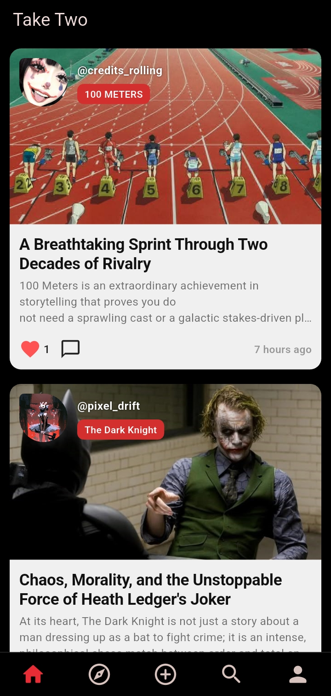
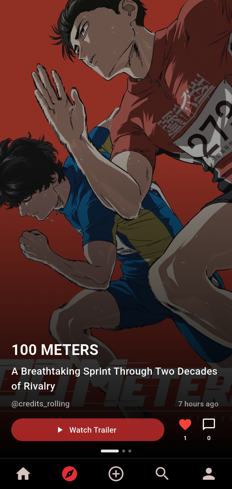
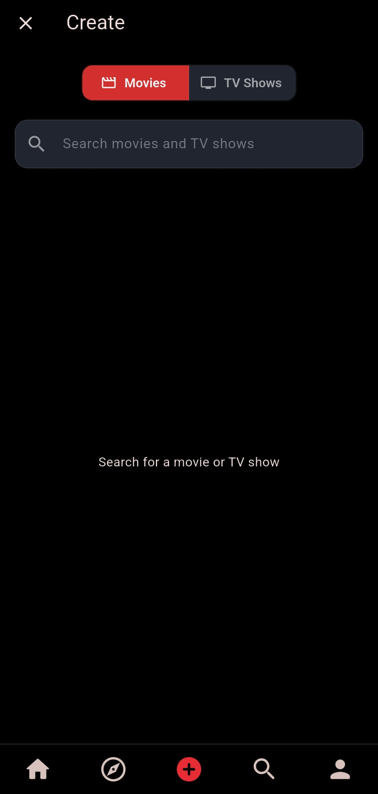
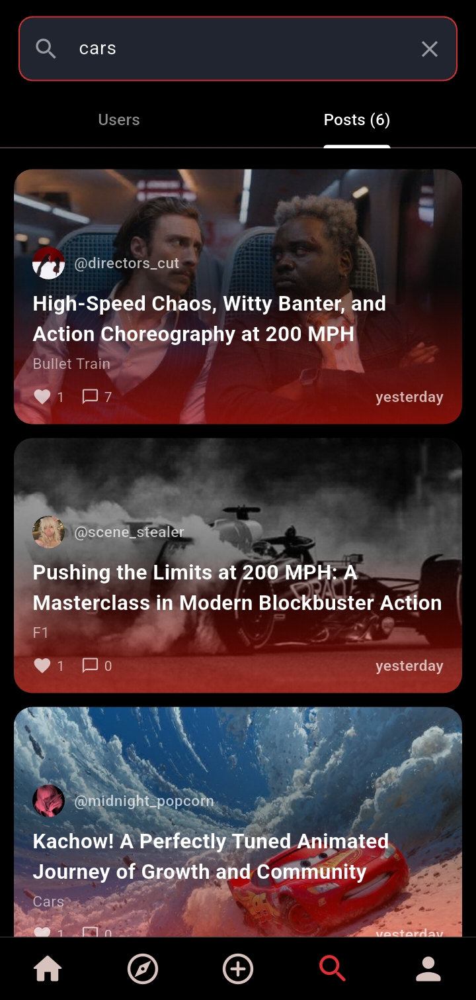
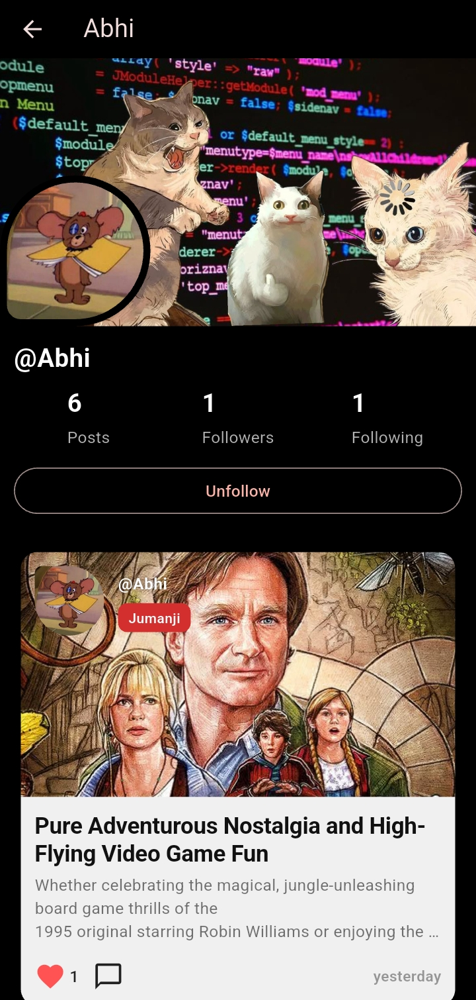

> ⚠️ **Demo Note:** This project is hosted on free-tier infrastructure. If the live site or backend takes 30 seconds to respond on your first click, it's just waking up from an idle sleep state! 
> 
> **Want to test it instantly without signing up?** Use these pre-configured test credentials:
> ```text
> Username: the_almighty
> Password: 123password
> ```


# Take Two 🎬

A social app for discovering, discussing, and sharing opinions on movies and TV shows.

## Demo

🎥 **Walkthrough:**
[Demo Video](https://youtu.be/GwIIwNnSdrs?si=sMvceW3j0DGfRGTI)

<p align="center">
  
  
  
  
  
</p>

## About

Take Two combines movie discovery with social features, allowing users to discover movies and TV shows, share their opinions, and interact with other users.

The project was built as a full-stack application with a Flutter mobile client and Django REST backend, using TMDB as the external movie and TV data source.

## Features

- 🔐 User authentication and genre-based onboarding
- 🎬 Movie and TV show discovery powered by TMDB
- 📝 Create posts about movies and TV shows
- ❤️ Like posts and comments
- 💬 Comments and replies
- 👥 Follow and unfollow users
- 🔎 Search users and posts
- 👤 User profiles with posts and follower/following counts
- 🤝 Follow suggestions based on shared interests
- 🎞️ Explore feed with immersive movie/post discovery
- ▶️ Movie and TV trailers
- 🖼️ Profile pictures and post images
- 🔄 Pull-to-refresh and infinite scrolling
- ⚡ Optimistic interactions for likes and comments
- 📡 Loading, error, and empty states

## Tech Stack

### Frontend

- **Flutter**
- **Dart**
- **Riverpod** — state management
- **GoRouter** — navigation
- **CachedNetworkImage** — image caching

### Backend

- **Django**
- **Django REST Framework**
- **PostgreSQL**
- Token-based authentication

### External Services

- **TMDB API** — movie and TV metadata
- **YouTube** — movie and TV trailers

## Architecture

The application follows a feature-based Flutter structure with shared models and providers.

```text
Flutter App
│
├── Auth
├── Home
├── Explore
├── Create
├── Search
└── Profile
        │
        ▼
   Riverpod Providers
        │
        ▼
     API Services
        │
        ▼
   Django REST API
        │
        ├── PostgreSQL
        │
        └── TMDB API
```

The Flutter client separates UI, state management, and API communication:

```text
Screen / Widget
      ↓
   Provider
      ↓
   Service
      ↓
   API
```

This keeps API logic out of the UI and makes application state easier to manage across screens.

## Key Technical Decisions

### Normalized Post State

Posts are stored in a normalized client-side cache rather than maintaining separate copies of the same post throughout the application.

When a post changes—for example, when a user likes it—the shared post state is updated and other screens can immediately reflect the change.

```text
                    ┌── Home
                    │
Post Cache ─────────┼── Search
                    │
                    ├── Explore
                    │
                    └── Post Detail
```

This prevents different screens from displaying stale versions of the same post.

### Optimistic Interactions

Likes and comments update the UI immediately rather than waiting for the server response.

This makes interactions feel much more responsive while the API request is completed in the background.

### Pagination

Feeds and search results use backend pagination with infinite scrolling.

This prevents the application from requesting an unnecessarily large number of posts or users at once.

### Explore Preloading

The Explore experience preloads upcoming content and caches movie artwork to reduce visible loading when moving through the feed.

This was particularly important for maintaining a smooth, immersive browsing experience.

### Debounced Search

Search requests are debounced so that the backend is not called for every individual keystroke.

```text
User types
    ↓
Wait briefly
    ↓
Query API
    ↓
Display results
```

### Shared API Models

API responses are converted into strongly typed Dart models using `fromJson`, keeping the rest of the application independent from raw JSON responses.

## Project Structure

```text
mobile/
├── lib/
│   ├── core/
│   │   ├── network/
│   │   ├── router/
│   │   └── ...
│   │
│   ├── features/
│   │   ├── auth/
│   │   ├── home/
│   │   ├── explore/
│   │   ├── create/
│   │   ├── search/
│   │   └── profile/
│   │
│   └── shared/
│       ├── models/
│       ├── providers/
│       └── ...
│
└── ...
```

The backend is organized into Django applications based on domain responsibilities:

```text
backend/
├── accounts/
├── movie/
├── posts/
├── search/
├── social/
└── ...
```

## Main User Flow

```text
Register
   ↓
Select preferred genres
   ↓
Home Feed
   ↓
Explore / Search
   ↓
Select Movie or TV Show
   ↓
Create Post
   ↓
Like / Comment / Reply
   ↓
Follow Users
   ↓
Discover More Content
```

## Screens

### Home

Personalized social feed containing posts from followed users and relevant suggestions.

### Explore

A cinematic discovery experience focused on movie and TV posts, with movie information, trailers, and related posts.

### Create

Search TMDB for a movie or TV show, select a title, and create a post around it.

### Search

Search independently across users and community posts with paginated results.

### Profile

View personal information, posts, followers, following, and other users' profiles.

## Running Locally

### Backend

Clone the repository and navigate to the backend:

```bash
git clone <repository-url>
cd <repository>
```

Create and activate a virtual environment:

```bash
python -m venv venv
```

Windows:

```bash
venv\Scripts\activate
```

Install dependencies:

```bash
pip install -r requirements.txt
```

Create your environment variables and configure the database and TMDB credentials.

Run migrations:

```bash
python manage.py migrate
```

Start the development server:

```bash
python manage.py runserver
```

### Flutter

Navigate to the Flutter application:

```bash
cd mobile
```

Install dependencies:

```bash
flutter pub get
```

Configure the API base URL for your environment, then run:

```bash
flutter run
```

## Environment Variables

The project requires environment-specific configuration for values such as:

```text
SECRET_KEY
DEBUG
DB_NAME
DB_USER
DB_PASSWORD
DB_HOST
DB_PORT
TMDB_API_KEY
TMDB_API_TOKEN
CLOUDINARY_CLOUD_NAME
CLOUDINARY_API_KEY
CLOUDINARY_API_SECRET
JWT_SECRET
```

The actual credentials are intentionally excluded from the repository.

## Future Improvements

Some possible extensions include:

- Explore filtering based on genre
- Post sorting in profile
- More advanced recommendation algorithms
- Additional media discovery features
- Notification support
- Expanded content moderation
- Persistent cloud media storage
- Rate limiting and other security implementation

## Why I Built It

Take Two was built to explore mobile development with Flutter while applying the full-stack experience I already had with Django and web development.

The project also gave me an opportunity to work with a third-party media API, mobile state management, caching, pagination, optimistic UI updates, and production deployment in a single application.

---

## License

This project is for portfolio and educational purposes.
